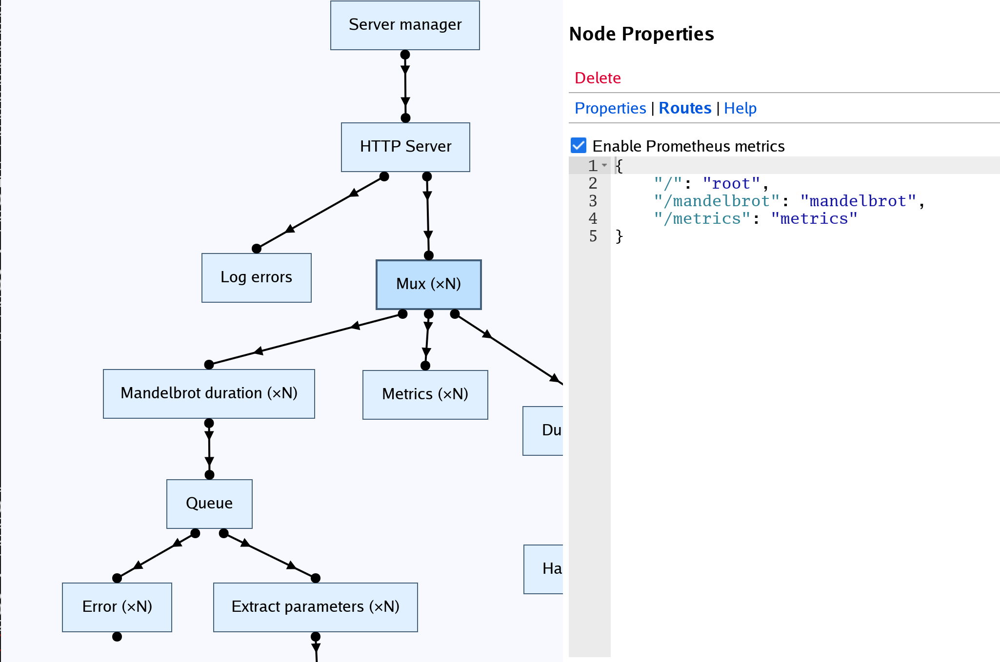

# "SHENZHEN GO" (working title)

  

SHENZHEN GO (working title) is an **experimental** visual Go environment, 
inspired by programming puzzle games such as TIS-100 and SHENZHEN I/O.

SHENZHEN GO provides a UI for editing a "graph," where the nodes are 
goroutines and the arrows are channel reads and writes. (This is analogous
to multiple "microcontrollers" communicating electrically in a circuit.)
It can also convert a graph into pure Go source code, which can be compiled 
and run, or used as a library in a regular Go program.

[SHENZHEN GO was unveiled](https://www.youtube.com/watch?v=AB9AUAmMlDo) at 
the [linux.conf.au 2017 Open Source & Games Miniconf](https://linux.conf.au/schedule/presentation/8/).

Read more at https://google.github.io/shenzhen-go.

## Getting started

See the getting-started guides at https://google.github.io/shenzhen-go.

### ...for the impatient gopher

Choose one of:

    go get -u github.com/google/shenzhen-go
    go get -u -tags webview github.com/google/shenzhen-go

## Notes

This is not an official Google product.

This is an experimental project - expect plenty of rough edges and bugs, and 
no support.

For discussions, there is [a Google Group](https://groups.google.com/forum/#!forum/szgo) and [a Slack channel](https://gophers.slack.com/messages/shenzhen-go).

## Acknowledgements

This project wouldn't be nearly as good as it is without the following:

* The [Ace](https://ace.c9.io/) code editor.
* [Chrome Hterm](https://chromium.googlesource.com/apps/libapps/+/master/hterm).
* [GopherJS](https://github.com/gopherjs/gopherjs).
* [gRPC](https://grpc.io/).
* [Improbable's gRPC-Web for Go](https://github.com/improbable-eng/grpc-web).
* Johan Brandhorst's [GopherJS bindings for gRPC-Web](https://github.com/johanbrandhorst/protobuf).
