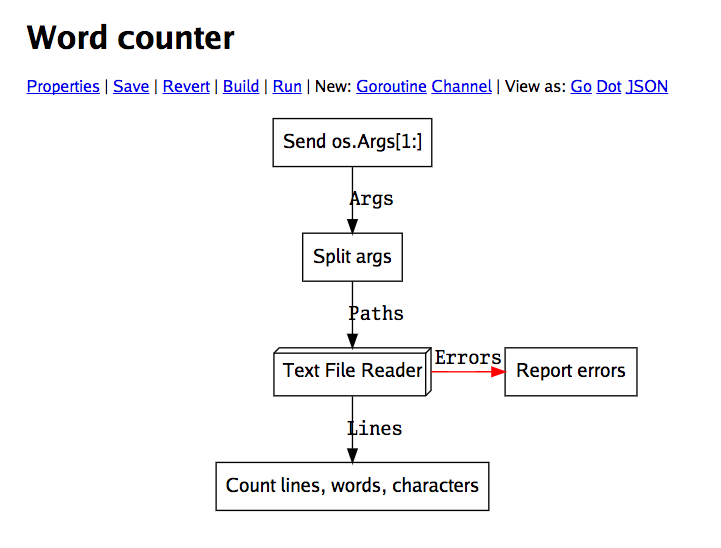

# "SHENZHEN GO" (working title)

  

SHENZHEN GO (working title) is an **experimental** visual Go environment, 
inspired by programming puzzle games such as TIS-100 and SHENZHEN I/O.

SHENZHEN GO provides a UI for editing a "graph," where the nodes are 
goroutines and the arrows are channel reads and writes. (This is analogous
to multiple "microcontrollers" communicating electrically in a circuit.)
It can also convert a graph into pure Go source code, which can be compiled 
and run, or used as a library in a regular Go program.

[SHENZHEN GO was unveiled](https://www.youtube.com/watch?v=AB9AUAmMlDo) at 
the [linux.conf.au 2017 Open Source & Games Miniconf](https://linux.conf.au/schedule/presentation/8/).

Read more at https://google.github.io/shenzhen-go.

## Versions

There are currently TWO versions of Shenzhen Go. The original Graphviz-based
prototype is "v0", and mostly works. The second version, "v1", is not ready yet,
so for now it lives in the "dev" directory.

## Dependencies

Shenzhen Go (v0) requires:

*   [Go 1.7+](https://golang.org/)
*   [Graphviz](http://graphviz.org/)
*   A web browser (e.g. [Chrome](https://www.google.com/chrome)).

## Installation

If you are using Go 1.7, you need to have set your `$GOPATH` (common choices are `$HOME` and 
`$HOME/go`, but it's up to you). 
[For Go 1.8, the default `$GOPATH` is `$HOME/go`](https://rakyll.org/default-gopath/) so it
is not necessary to set it (but you can change it to override the default if you want).

To install, open a terminal and run:

    go get -u github.com/google/shenzhen-go/v0/cmd/shenzhen-go

This should create the `shenzhen-go` binary in your `$GOPATH/bin` directory.
Run it:

    $GOPATH/bin/shenzhen-go

and a web browser should appear with SHENZHEN GO (if not, navigate to 
http://localhost:8088/ manually). 

The file browser is limited to the directory `shenzhen-go` was started in.

Navigate to the `examples/primes.szgo` file and play around - this demonstrates 
an example prime number sieve program.

## Notes

This is not an official Google product.

This is an experimental project - expect plenty of rough edges and bugs, and 
no support.

For discussions, there is [a Google Group](https://groups.google.com/forum/#!forum/szgo) and [a Slack channel](https://gophers.slack.com/messages/shenzhen-go).
