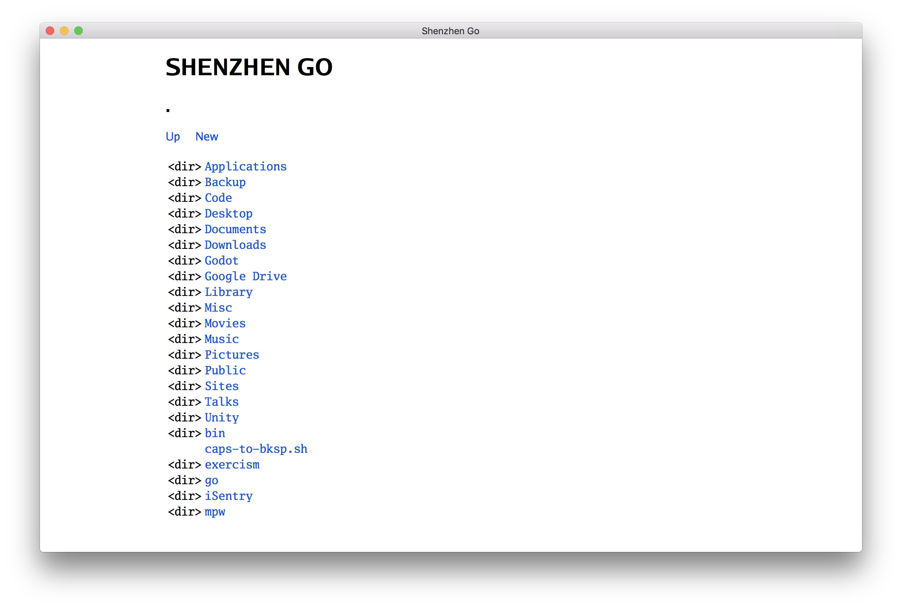
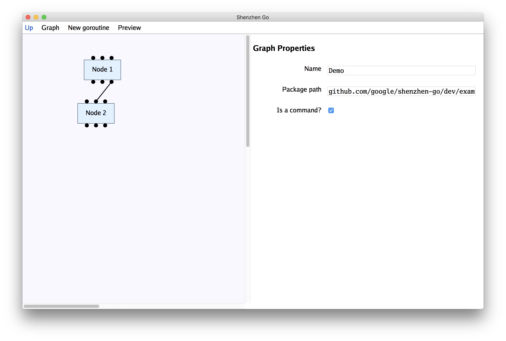
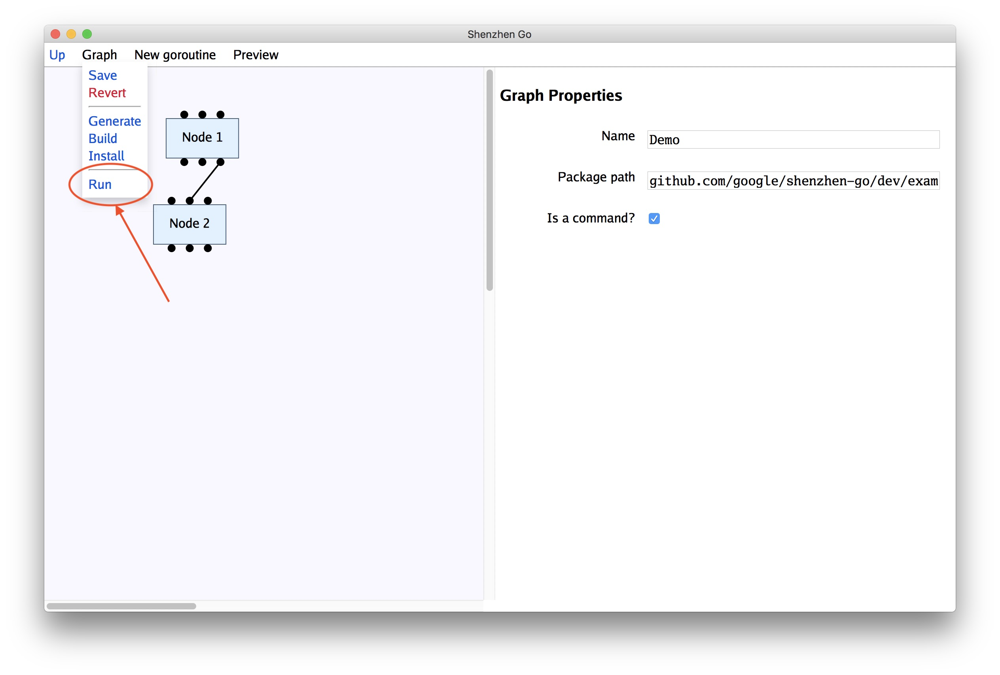

# Getting Started

Contents:

* [Home](index.md)
* [Getting Started with v1](getting-started-v1.md)
* [Getting Started with v0](getting-started-v0.md)
* [Roadmap](roadmap.md)

## About versions

There are two versions of Shenzhen Go: the prototype that's deprecated, and the new version that isn't ready yet.
This guide describes the new version that isn't quite ready yet (`dev`), which will become `v1` when it's ready.

## Installation

### Pre-requisites

If you already have Go and Git installed, skip to the next section. Otherwise, continue here.

First, [install Go](https://golang.org/dl/). The instructions vary by operating system.
To quickly check that it is (probably) installed correctly, open a terminal and enter:

    go version

If this prints a `go version ...`, it's working.

Go is required both to install the Shenzhen Go program, and also to build any programs
you write with it.

Secondly, [install Git](https://git-scm.com/downloads) if not already available.
To quickly check that Git is (probably) installed correctly, open a terminal and enter:

    git version

If this prints a `git version ...`, it's working.

### Installing 

To install Shenzhen Go, open a terminal and enter:

    go get -u github.com/google/shenzhen-go/dev/cmd/shenzhen-go

This should automatically download all the needed Go packages,
build the `shenzhen-go` program, and put it in the `go/bin` directory.

From a terminal in your home directory, run

    go/bin/shenzhen-go

(or for Windows, something similar to `go\bin\shenzhen-go.exe`).

A web browser should appear and load the Shenzhen Go user interface 
(if not, follow the instructions it prints out). 

## Navigating

The first view that loads is a file browser.

Clicking on the blue links navigates through files and directories. 
If you started `shenzhen-go` in your home directory, you can get to the
example programs by navigating:

* `go`
* `src`
* `github.com`
* `google`
* `shenzhen-go`
* `dev`
* `examples`

Once in the `examples` folder, click on `demo.szgo` to open it.

To speed this process up next time, you can start Shenzhen Go with a path to a file to open as an argument:

    shenzhen-go go/src/github.com/google/shenzhen-go/dev/examples/demo.szgo

## Editing

Once you have opened `demo.szgo`, the browser should look like this:

(Not the most exciting user interface - I know, I'm working on it.)

To test that the demo program works, hover over the Graph menu and click on Run.

